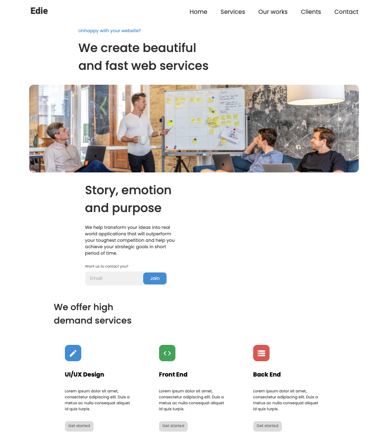

<!-- Please update value in the {}  -->

<h1 align="center">{Edie Homepage}</h1>

<div align="center">
   Solution for a challenge from  <a href="http://devchallenges.io" target="_blank">Devchallenges.io</a>.
</div>

<div align="center">
  <h3>
    <a href="https://vanessasg.github.io/edie-homepage/">
      Demo
    </a>
    <span> | </span>
    <a href="https://github.com/vanessasg/edie-homepage">
      Solution
    </a>
    <span> | </span>
    <a href="https://devchallenges.io/challenges/xobQBuf8zWWmiYMIAZe0">
      Challenge
    </a>
  </h3>
</div>

<!-- TABLE OF CONTENTS -->

## Table of Contents

- [Overview](#overview)
  - [Built With](#built-with)
- [Features](#features)
- [How to use](#how-to-use)
- [Contact](#contact)
- [Acknowledgements](#acknowledgements)

<!-- OVERVIEW -->

## Overview



### Built With

- [HTML5]
- [SCSS]

## Features

This application/site was created as a submission to a [DevChallenges](https://devchallenges.io/challenges) challenge. The [challenge](https://devchallenges.io/challenges/xobQBuf8zWWmiYMIAZe0) was to build an application to complete the given user stories.

## How To Use

<!-- Example: -->

To clone and run this application, you'll need [Git](https://git-scm.com) and [Node.js](https://nodejs.org/en/download/) (which comes with [npm](http://npmjs.com)) installed on your computer. From your command line:

```bash
# Clone this repository
$ git clone https://github.com/your-user-name/your-project-name

# Install dependencies
$ npm install

# Run the app
$ npm start
```

## Acknowledgements

- [Steps to replicate a design with only HTML and CSS](https://devchallenges-blogs.web.app/how-to-replicate-design/)
- [Node.js](https://nodejs.org/)
- [Marked - a markdown parser](https://github.com/chjj/marked)

## Contact

- Codepen [@vanessasg](https://codepen.io/vanessasg)
- GitHub [@vanessasg](https://github.com/vanessasg)
